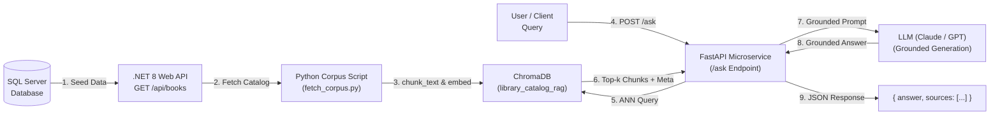

# 📚 Library Management System & AI Service (Week 5 Milestone)

**Author / Intern:** Asiya  
**Repository:** [`asiyaibrahim478/week4_internship`](https://github.com/asiyaibrahim478/week4_internship.git)  
**Milestone Version:** `v0.5-week5`

[](https://github.com/asiyaibrahim478/week4_internship)
[](https://dotnet.microsoft.com/)
[](https://angular.dev/)
[](https://fastapi.tiangolo.com/)
[](https://docs.trychroma.com/)
[](https://learn.microsoft.com/en-us/ef/core/)

---

## 🌟 Overview & Week 5 Objectives (Embeddings & RAG Fundamentals)

Week 5 introduces **Retrieval-Augmented Generation (RAG)**, transforming the AI track from general chat into a grounded knowledge assistant backed by the real library catalog:
1. **Part A (Embeddings Fundamentals):** Dense vector generation (`text-embedding-3-small`), geometric cosine similarity calculation, and semantic distance verification.
2. **Part B (Vector Databases & ChromaDB):** Standing up a local Chroma vector database, indexing document chunks with metadata, performing Approximate Nearest Neighbor (ANN) search, and metadata filtering.
3. **Part C (Manual 8-Stage RAG Pipeline):** Building the full manual pipeline: Ingestion $\rightarrow$ Chunking (fixed-size + overlap) $\rightarrow$ Embedding $\rightarrow$ Vector Storage $\rightarrow$ Retrieval $\rightarrow$ Grounded Prompt Assembly $\rightarrow$ LLM Synthesis $\rightarrow$ Source Attribution.
4. **Part D (RAG Quality & Hallucination Reduction):** Grounding constraints (*"If not in context, say I don't have that information"*), evaluation benchmark across 5 questions, diagnosing retrieval vs. generation failures, and chunk-size tuning.
5. **Part E & Project (FastAPI `/ask` Endpoint & Library Assistant):** Fetching real catalog data from .NET API (`GET /api/books`), embedding chunks into persistent Chroma collection, and exposing `POST /ask` with grounded Q&A and verified source citations.
6. **Part F (Git Safe Revert):** Performing `git revert` to safely undo commits on protected branches without rewriting public history.

---

## 🔄 Week 5 RAG Data Flow Architecture



> [!NOTE]
> The AI service reading from the .NET API's public GET endpoint is a one-way connection used only to build the RAG corpus. The complete three-way orchestration (**Angular $\rightarrow$ .NET API $\rightarrow$ AI Service**) will be integrated in **Week 6** with LangChain.

---

## 🏗️ Repository Structure

```text
├── LibraryAPI/                       # ASP.NET Core 8 Web API
│   ├── Controllers/                  # AuthController (JWT, Register, Login), BooksController
│   ├── Data/                         # LibraryDbContext (EF Core)
│   ├── DTOs/                         # RegisterDto, LoginDto, AuthResponseDto
│   ├── Models/                       # Book, Author, Category, User
│   ├── Repositories/                 # IBookRepository, BookRepository, InMemoryBookRepository
│   ├── Services/                     # IBookService, BookService
│   ├── appsettings.Development.json  # JWT Secrets (Development)
│   └── Program.cs                    # JWT Auth Scheme, Swagger Bearer, CORS, Pipeline
│
├── library-frontend/                 # Angular 17/18 Standalone Client
│   ├── src/app/
│   │   ├── components/login/         # Reactive Login & Register component
│   │   ├── book-list/                # Book catalog with Admin-conditional actions
│   │   ├── book-form/                # Guarded Book creation form
│   │   ├── services/                 # AuthService (JWT state, signals)
│   │   ├── interceptors/             # Functional authInterceptor
│   │   ├── guards/                   # Functional authGuard
│   │   ├── app.config.ts             # withInterceptors([authInterceptor])
│   │   └── app.routes.ts             # Route configurations with authGuard
│
├── ai-service/                       # FastAPI AI Microservice (Python)
│   ├── main.py                       # FastAPI application & Pydantic endpoints
│   ├── prompts.py                    # Zero-Shot, Few-Shot & Role-based Prompt Templates
│   ├── requirements.txt              # FastAPI, Uvicorn, Pydantic dependencies
│   └── README.md                     # Microservice guide & test curl commands
│
├── Week4_PartA_AuthBackend/          # Part A documentation & test commands
├── Week4_PartB_AngularAuth/          # Part B architecture notes & interceptor design
├── Week4_PartC_FastAPI/              # Part C FastAPI foundations & OpenAPI notes
├── Week4_PartD_LLM/                  # Part D LLM scripts (History, Streaming, JSON)
├── Week4_PartE_PromptEngineering/    # Part E Prompt experiments & injection tests
├── Week4_PartF_GitPractice/          # Part F Merge conflict resolution guide
├── Week4_CheckStage_Answers.md       # Comprehensive check stage questions & answers
├── .github/
│   └── PULL_REQUEST_TEMPLATE.md      # Standardized PR template
└── README.md                         # Project documentation
```

---

## 🚀 How to Run the Applications

### 1. Backend (.NET 8 Web API)
```bash
cd LibraryAPI
dotnet build
dotnet run
```
- **API URL:** `http://localhost:5252`
- **Swagger Documentation:** `http://localhost:5252/swagger` (Use the **Authorize** lock button to supply your Bearer JWT).

### 2. Frontend (Angular Client)
```bash
cd library-frontend
npm install
npm start
```
- **Web UI:** `http://localhost:4200`
- **Demo Accounts:**
  - **Admin User:** `admin` / `Admin123!` (Full permissions + Delete)
  - **Standard User:** `Asiya` / `password123` (View / Add / Edit)

### 3. AI Microservice (FastAPI + Python)
```bash
cd ai-service
pip install -r requirements.txt
uvicorn main:app --reload --port 8000
```
- **Interactive Swagger Docs:** `http://localhost:8000/docs`
- **Health Check:** `http://localhost:8000/health`

---

## 📡 REST API Specifications

### Authentication Endpoints (`LibraryAPI`)
| Method | Endpoint | Access | Description |
| :--- | :--- | :--- | :--- |
| `POST` | `/api/auth/register` | Public | Registers a new user with hashed password |
| `POST` | `/api/auth/login` | Public | Validates credentials and returns JWT Bearer token |

### Book Catalog Endpoints (`LibraryAPI`)
| Method | Endpoint | Required Authorization | Description |
| :--- | :--- | :--- | :--- |
| `GET` | `/api/books` | Public | Retrieves all books |
| `GET` | `/api/books/{id}` | Public | Retrieves a single book by ID |
| `POST` | `/api/books` | `Bearer JWT` (Any User) | Adds a new book |
| `PUT` | `/api/books/{id}` | `Bearer JWT` (Any User) | Updates an existing book |
| `DELETE` | `/api/books/{id}` | `Bearer JWT` (`Admin` role only) | Removes a book (403 for non-admins) |

### AI Microservice Endpoints (`ai-service`)
| Method | Endpoint | Description |
| :--- | :--- | :--- |
| `GET` | `/health` | Health probe & service metadata |
| `POST` | `/summarize` | Returns structured JSON summary & genre classification |
| `POST` | `/genre-suggestion` | Few-shot conditioned genre categorization |
| `POST` | `/prompt-injection-test` | Demonstrates defensive input isolation |

---

## 🛡️ Git Workflow & Conventional Commits

Commit history adheres to conventional commit formatting:
- `feat:` Feature implementations (`feature/jwt-auth-backend`, `feature/angular-auth`, `feature/ai-fastapi-service`)
- `fix:` Bug fixes and conflict resolutions
- `docs:` Documentation updates
- `chore:` Configuration and PR templates

**Milestone Release Tag:** `v0.4-week4`
